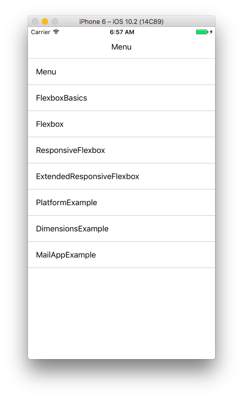
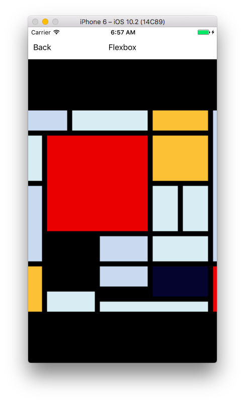
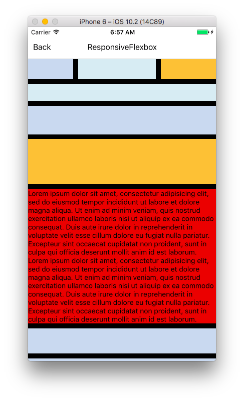

# react-native-responsive-layout

CSDN [跨平台开发在线峰会](http://edu.csdn.net/huiyiCourse/detail/268)中“React Native 跨平台响应式布局”主题分享中的 Demo。

## 使用方法

1. 首先请确保您已经[搭建了ReactNative的开发环境](https://reactnative.cn/docs/0.42/getting-started.html#content)
2. 打开命令行环境，并导航到本项目的根目录
3. 执行 `npm install` 安装依赖
4. 执行 `react-native start` 启动 ReactNative Packager
5. 另外新开一个命令行环境，并导航到本项目的根目录
6. 执行 `react-native run-ios` 启动模拟器以及范例应用

## 屏幕截图

## 联系方式

微博: http://www.weibo.com/toruta39
Twitter: https://twitter.com/toruta39
